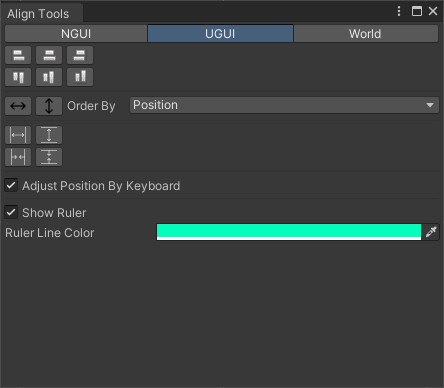
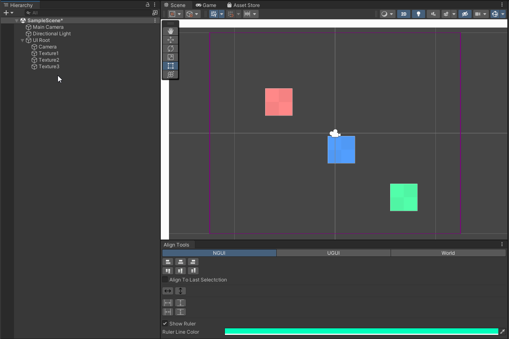

# Align Tools

[AlignTools] 是一个在Unity中使用的对齐工具，支持UGUI、NGUI以及任意场景中的GameObject，并包含简单的UI标尺功能

## Screenshots

## 说明
此版本与主干版本相比，仅多出NGUI支持。如不需要NGUI支持，建议使用[主干版本]
### 使用方法

1. 工具打开路径： [Window] > [LiteFeel] > [Align Tools] > [Align Tool]
2. 选择多个UI/GameObject
3. 点击所需的对齐按钮

### 额外添加的特性
#### 与指定NGUI widget对齐
* 取消勾选勾选NGUI 页签的` Align To Last Selection `，对齐时将对齐至最边缘的UI：

* 勾选勾选NGUI 页签的` Align To Last Selection `，对齐时将对齐至最后选中的UI：

[AlignTools]: https://github.com/0right/Unity-AlignTools
[主干版本]: https://github.com/litefeel/Unity-AlignTools

